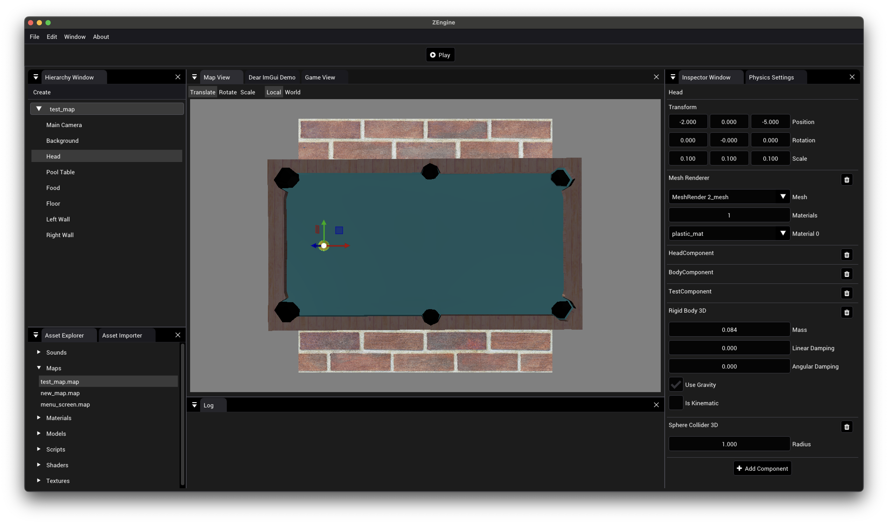

# ZEngine



ZEngine is a hobby Game Engine. Initially undertaken as a university assignment and has since evolved into an expansive hobby project. The engine is developed primarily in C++, leveraging CMake as its build system. The project consists of three major components:

* ZEngine-Core: The core library that provides the fundamental functionalities of the engine.
* ZEngine-Editor: A user-friendly UI for map editing.
* ZEngine-Player: A runtime environment for playing the game.

## Prerequisites

ZEngine utilizes a variety of libraries, each serving specific purposes to ensure efficient and seamless functionality. These include:

* `C# (.NET 8)`: Scripting.
* `assimp`: Model loading.
* `bgfx`: Platform agnostic rendering.
* `imgui`: UI rendering.
* `sdl2` + `sdl2_mixer`: Audio.
* `glfw`: Platform agnostic window & input management.
* `glm`: Math operations.
* `stb-image`: Image loading.
* `nlohmann-json`: For serializing and deserializing JSON data.
* `Nvidia PhysX 5`: 3D Physics engine.

The project incorporates git submodules for managing some of these libraries. Therefore, initialization of these submodules is necessary.

Otherwise you need to install the libraries using `brew` or `apt-get` or whatever package manager you use.

## Building the Project

First you need to build PhysX. To do this run the following commands:

```shell
cd 3rdparty/PhysX/physx
./generate_projects.sh

cmake --build . --config checked
```

Then to build the project, you will need to execute the following commands:

```shell
mkdir build
cd build
cmake ../
make -j12
```

## Platform Compatibility

ZEngine has primarily been developed and tested on MacOS. It has some experimental support for iOS, but this is a work in progress. The engine is not currently compatible with Windows or Linux, but the libraries used are cross-platform, so it should be possible to get it working on these platforms with some effort.

## iOS Support (very experimental)

To generate the project for iOS, you will need to execute the following commands:

```shell
./generate-ios-project.sh
```

Then open the generated XCode project and build the ZEngine-Player target:
```shell
open iOS-Build/ZEngine.xcodeproj
```
